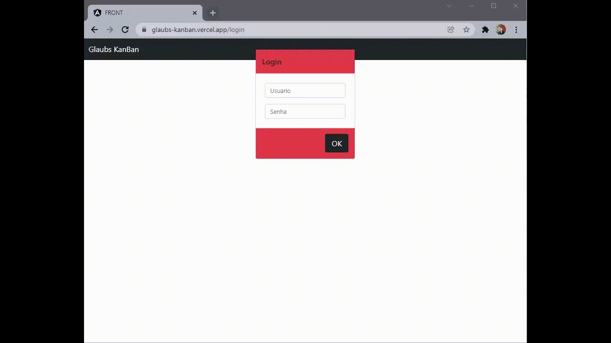

# [Glaubs Kanban](https://glaubs-kanban.vercel.app/)

 <a href="# 📷 Demo">Demo</a> •
 <a href="# ℹ️ About it">About it</a> • 
 <a href="# 🔗 Requirements">Requirements</a> • 
 <a href="# 🛠 Stack">Stack</a> • 
 <a href="# 👨‍💻 Author">Author</a> • 
 <a href="# 👏 Thank you!">Thank you</a>

  

# 📷 Demo

  

# ℹ️ About it

[Glaubs Kanban](https://glaubs-kanban.vercel.app/) is a [Kanban Board](https://en.wikipedia.org/wiki/Kanban) developed to boost the learning curve when developing an [Angular](https://angular.io/) application.
The user must be able to:

-   See the elements in the board in a readable way.
-   Add new elements to the board.
-   Edit elements in the board.
-   Move elements from one column to another.
-   Remove elements from the board.
  

# 🔗 Requirements

1. API must be used to persist cards data

2. Only one web page with three columns ("To do", "Doing", "Done") must be used

3. Cards must be sorted based on a parameter called "list"

4. Additional cards could be added to the board fulfilling two parameters: "title" and "description"

5. The new card must start in the "To do" column

6. Cards must have two modes: "edit" and "view"

7. In the view mode, cards must have a title and a description text field. Additionaly cards must have four buttons 

8. One button is responsable for delete the card, other will change it to edit mode

9. Other two buttons will move cards to the left collumn and to the right collumn. 

10. In edit mode the card must have a title and a description text field. Additionaly cards must have two buttons.

11. One button must cancel edit mode, reset any change and return the card to view mode

12. Other button will save the values persisting it in API and return to view mode.

13. Visual style is free to choose, but uses only one page.

14. Use github to share your project. Readme must be updated with the info about the project (how to run, how to contribute, etc). 

15. Only one link to the project must be provided.
  

# 🛠 Stack

The following stack was used to develop Glaubs Kanban:

-   [Angular](https://angular.io/)
-   [Bootstrap](https://getbootstrap.com/)
-   [Typescript](https://www.typescriptlang.org/)
-   [API](https://developer.mozilla.org/pt-BR/docs/Web/API)
      

# 👨‍💻 Author

-   [Linkedin](https://www.linkedin.com/in/glauberio/)
-   [GitHub](https://github.com/gapjr)
      

# 👏 Thank you!

Thank you [Santander Coders Web Full Stack 2021](https://app.becas-santander.com/en/program/bolsas-santander-tecnologia-santander-coders-web-full-stack-2021) and [Let's Code](https://letscode.com.br/) for supporting developers to pursuit their dreams.